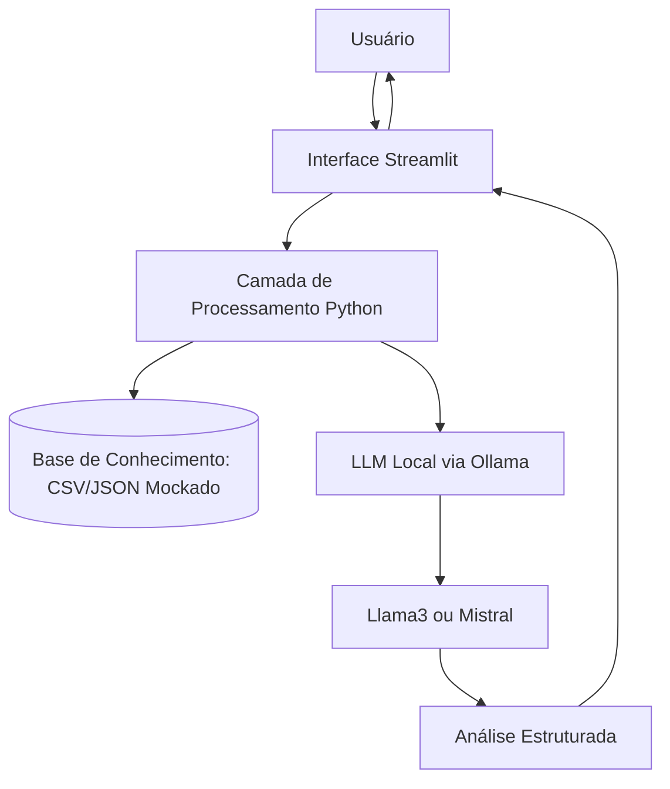

# Zola FinPlan
### Inteligência Estruturada para Decisões Financeiras Empresariais

 ## 1. Sumário Executivo

A Zola FinPlan é um assistente de apoio à decisão empresarial focado em organização de fluxo de caixa e simulação de cenários financeiros em horizonte de 30 dias.

Seu objetivo é transformar dados operacionais em análise estruturada, permitindo decisões mais previsíveis e fundamentadas.

 ## 2. Problema

Pequenas e médias empresas frequentemente tomam decisões financeiras sem projeção clara de liquidez.

Consequências:
- Comprometimento de caixa
- Investimentos mal dimensionados
- Endividamento desnecessário
- Falta de previsibilidade
  
## 3. Solução 

A Zola FinPlan organiza decisões financeiras por meio de:
- Projeção de fluxo de caixa (30 dias)
- Simulação de cenários (“E se eu investir X?”)
- Identificação de risco de liquidez

As respostas seguem estrutura padronizada:
> Cenário Atual → Riscos → Recomendação → Próximos Passos

## 4. Público-Alvo
- Pequenos empresários
- Fundadores
- Gestores financeiros
- Empresas sem estrutura de CFO

## 5. Identidade do Agente

Persona: Consultor financeiro estratégico
Tom: Profissional, objetivo e analítico

## 6. Arquitetura Técnica

A solução foi projetada com foco em processamento local e confidencialidade.

#### Fluxo de Dados

### Stack Tecnológica

|Componente |Descrição|
|------------|-----------|
| Interface | Streamlit |
| Processamento | Python |
| Base de Conhecimento | Dados mockados empresariais |
| LLM | Modelo local via Ollama |
| Output | Análise estruturada|

## 7. Estratégia de Funcionamento
1. Usuário informa cenário financeiro
2. Sistema consulta dados mockados
3. Prompt estruturado é gerado
4. LLM local processa a análise
5. Resposta é entregue no formato padronizado

## 8. Segurança e Limitações
- Processamento local (dados não enviados para APIs externas)
- Não substitui contador ou consultor financeiro
- Não executa transações
- Depende da qualidade dos dados inseridos

## Proposta de Valor

A Zola FinPlan organiza decisões financeiras com base em projeção e análise estruturada, reduzindo risco e aumentando previsibilidade operacional.

> Zola — Infraestrutura para a Inteligência Empresarial.
