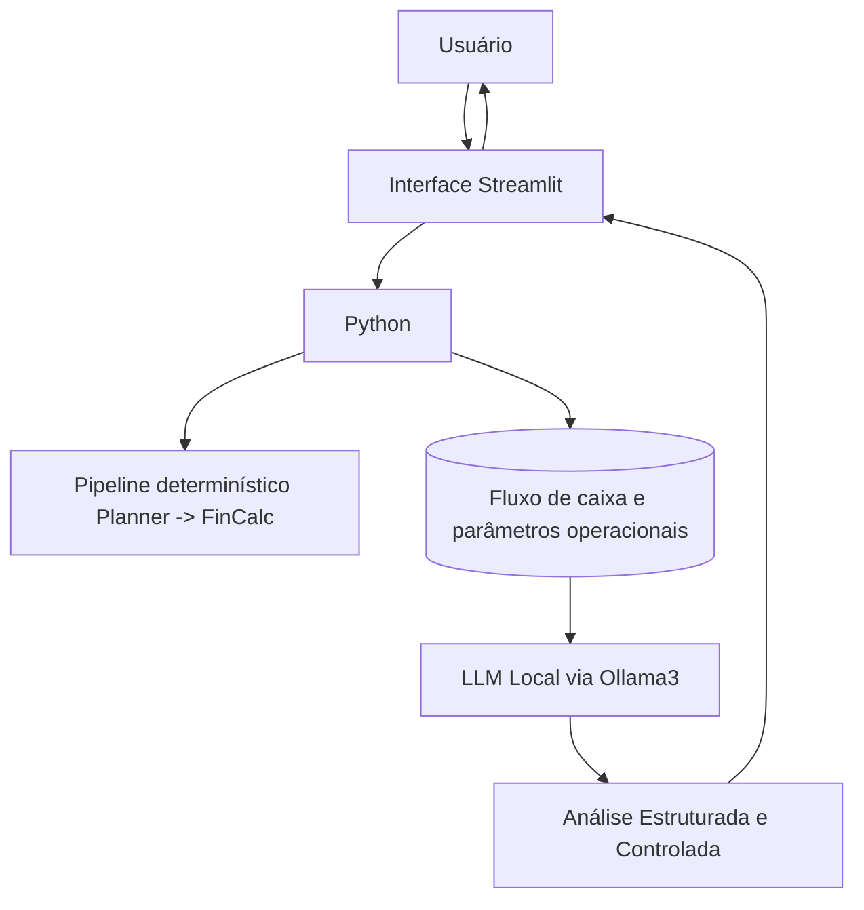

# Zola FinPlan
### Infraestrutura para Decisões Financeiras Operacionais

 ## 1. Sumário Executivo

A Zola FinPlan é um assistente de apoio à decisão empresarial voltado à organização de fluxo de caixa e simulação estruturada de cenários financeiros em horizonte de 30 dias.

Seu objetivo é transformar dados operacionais em análise previsível e estruturada, permitindo decisões fundamentadas e com controle de risco.

 ## 2. Problema

Pequenas e médias empresas frequentemente tomam decisões financeiras sem projeção clara de liquidez.

Consequências:
- Comprometimento de caixa
- Investimentos mal dimensionados
- Endividamento desnecessário
- Falta de previsibilidade
  
## 3. Solução 

A Zola FinPlan organiza decisões financeiras por meio de:
- Projeção de fluxo de caixa (30 dias)
- Simulação de cenários (“E se eu investir X?”)
- Classificação estruturada da reserva mínima (Atendida / Parcial / Zerada)
- Análise comparativa entre cenário atual e cenário proposto

As respostas seguem estrutura padronizada:
> Cenário Atual → Riscos Identificados → Análise Estruturada → Próximos Passos

## 4. Público-Alvo
- Pequenos empresários
- Fundadores
- Gestores financeiros
- Empresas sem estrutura de CFO

## 5. Identidade do Agente

Persona: Consultor financeiro estratégico
Tom: Profissional, objetivo, analítico e estruturado
Comportamento:
 - Não inventa números
 - Não realiza cálculos fora do pipeline determinístico
 - Não mistura explicação conceitual com simulação

## 6. Arquitetura Técnica

A solução foi projetada com foco em previsibilidade, processamento local e confidencialidade.

#### Fluxo de Dados

## 7. Estratégia de Funcionamento
 1. Usuário informa cenário ou conceito.
 2. Sistema identifica modo (Simulação ou Aula).
 3. Em simulação:
    - Planner classifica intenção.
    - FinCalc aplica cálculo determinístico.
    - Redactor gera análise baseada apenas no contexto calculado.
 4. Em modo aula:
     - Resposta estruturada e objetiva.
       
## 8. Segurança e Limitações
- Processamento local (dados não enviados para APIs externas)
- Não substitui contador ou consultor financeiro
- Não executa transações
- Depende da qualidade dos dados inseridos
- Não gera projeções especulativas fora do contexto fornecido

## Proposta de Valor

A Zola FinPlan organiza decisões financeiras com base em projeção e análise estruturada, reduzindo risco e aumentando previsibilidade operacional.

> Zola — Infraestrutura para a Inteligência Empresarial.
